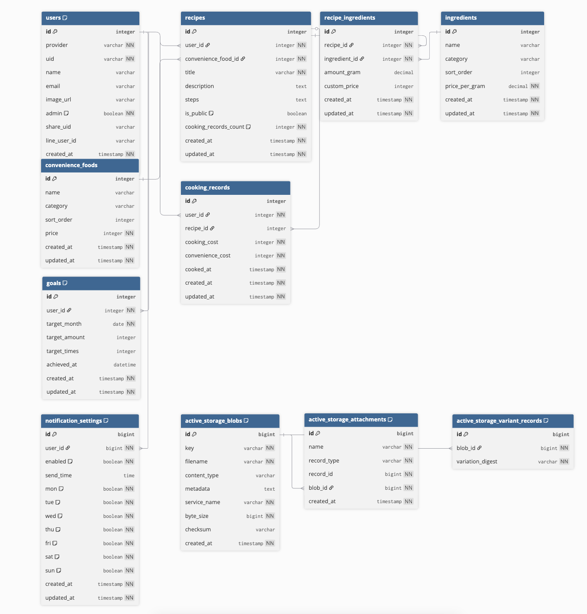

# 「自炊save」

# 目次
<!-- START doctoc generated TOC please keep comment here to allow auto update -->
<!-- DON'T EDIT THIS SECTION, INSTEAD RE-RUN doctoc TO UPDATE -->

- [サービスURL](#%E3%82%B5%E3%83%BC%E3%83%93%E3%82%B9url)
- [サービス概要](#%E3%82%B5%E3%83%BC%E3%83%93%E3%82%B9%E6%A6%82%E8%A6%81)
- [このサービスの背景](#%E3%81%93%E3%81%AE%E3%82%B5%E3%83%BC%E3%83%93%E3%82%B9%E3%81%AE%E8%83%8C%E6%99%AF)
- [サービスの使用イメージ](#%E3%82%B5%E3%83%BC%E3%83%93%E3%82%B9%E3%81%AE%E4%BD%BF%E7%94%A8%E3%82%A4%E3%83%A1%E3%83%BC%E3%82%B8)
  - [レシピ一覧](#%E3%83%AC%E3%82%B7%E3%83%94%E4%B8%80%E8%A6%A7)
  - [レシピ投稿](#%E3%83%AC%E3%82%B7%E3%83%94%E6%8A%95%E7%A8%BF)
  - [プロフィール](#%E3%83%97%E3%83%AD%E3%83%95%E3%82%A3%E3%83%BC%E3%83%AB)
  - [通知機能](#%E9%80%9A%E7%9F%A5%E6%A9%9F%E8%83%BD)
- [使用する技術スタック](#%E4%BD%BF%E7%94%A8%E3%81%99%E3%82%8B%E6%8A%80%E8%A1%93%E3%82%B9%E3%82%BF%E3%83%83%E3%82%AF)
- [画面遷移図](#%E7%94%BB%E9%9D%A2%E9%81%B7%E7%A7%BB%E5%9B%B3)
- [ER図](#er%E5%9B%B3)

<!-- END doctoc generated TOC please keep comment here to allow auto update -->

## サービスURL
https://jisui-save.com

## サービス概要
「自炊って本当にお得なの？」の答えを数字で教えてくれるアプリです。
料理記録から外食との差額を自動計算し、節約効果を可視化します。
成功体験の積み重ねで、自炊が楽しく続けられるようになります。

## このサービスの背景
世の中、節約レシピは溢れているのに、「本当に節約できてるの？」の答えは誰も教えてくれません。
この **「見えない成果」** が、自炊継続の最大の障壁だと考えています。

私自身、自炊をしていてもコンビニご飯とどれくらい金額差があるのか分からず、継続のモチベーションを失ってしまうことがありました。

そこで、自炊の最大のメリットである **節約額** にフォーカスし、
金額の差を手軽に可視化することで、自炊を前向きに続けられるサービスを作りたいと思いました。
「なんとなく節約できてはいるんだろうな、、」という考えから「約〇〇円節約！」と変換されるだけで
自炊に対しての見え方がポジティブなものになり、継続化や自炊を始めるきっかけにもなると考えています。

レシピアプリ → 作り方は分かるが節約効果は不明
家計簿アプリ → 支出は記録できるが外食との比較はできない
類似アプリでも解決できなかった  
**「自炊するとどれくらい得をしているのか」**  
このシンプルな疑問に応えるために、
**自炊 × 節約**
という新しい切り口で、自炊のモチベーションをあげていきたいと考えました。

自炊の習慣化への課題は、LINE通知の機能を付け、ユーザー自身のペースで設定することで、
「毎日は大変」「お昼のお弁当だけでも、、」とユーザーの生活に見合った自炊に無理なく取り組むことができると考えています。

## サービスの使用イメージ

### レシピ一覧

  <video src="https://github.com/user-attachments/assets/aa6f6a7d-99ed-446f-b12d-828509edef45" width="300" autoplay loop muted playsinline></video>
  
レシピ一覧画面から「作るボタン」を押し、自炊記録ができます

### レシピ投稿

  <video src="https://github.com/user-attachments/assets/96ec28ef-e1c3-406b-9f45-c3d8a96c5656" width="300" autoplay loop muted playsinline></video>
  
投稿画面では、レシピの金額と、節約額（比較商品との差異）がリアルタイムで計算されます

### プロフィール

  <video src="https://github.com/user-attachments/assets/a720dc6a-38c1-4805-a5af-2403b3f7b508" width="300" autoplay loop muted playsinline></video>
  
グラフや目標機能で、視覚的に頑張りを実感できます

### 通知機能

  <video src="https://github.com/user-attachments/assets/e7f1004a-5c1b-415b-8cd5-a18eda837e34" width="300" autoplay loop muted playsinline></video>
  
決めた時間にLINE通知を行い、習慣化をサポートします

## 使用技術スタック

| カテゴリ | 技術 |
|--------------|------|
| フロントエンド | Tailwind CSS / JavaScript(Hotwire) |
| バックエンド | Ruby 3.3.6 / Ruby on Rails 7.2.3 |
| データベース | PostgreSQL 18 |
| インフラ | Render / GitHub Actions / Docker |
| ストレージ | Cloudinary |
| テスト | RuboCop / RSpec |
| 認証・API連携 | OmniAuth-google-oauth2 / OmniAuth-line / Message API |

### 技術選定の理由
### 技術選定の理由
- **フロントエンド**: Hotwire（Turbo / Stimulus）を採用し、Rails標準の仕組みでSPA（シングルページアプリケーション）のような滑らかな操作感を実現。
- **バックエンド**: 安定性が高く、豊富な知見やGemが揃っているRuby on Rails 7.2系を採用。
- **データベース**: デプロイ先であるRenderとの親和性が高く、スケーラビリティに優れたPostgreSQL 18を選択。
- **インフラ**: Dockerによる環境構築の共通化に加え、GitHub Actionsを用いたCI/CDパイプラインを構築。プルリクエスト時に自動テストと自動デプロイが走る仕組みを導入。
- **ストレージ**: Cloudinaryを採用。無料枠が充実しており、画像の自動リサイズや配信最適化が容易なため。
- **テスト・品質管理**: RuboCopによる静的解析でコード品質を維持し、RSpecによる自動テストをGitHub Actionsで実行。
- **認証・API連携**: Google/LINEログインとLINE Messaging APIを組み合わせ、パスワード入力の手間を省いたシームレスなユーザー体験を提供。

## 画面遷移図
[Figma画面遷移図](https://www.figma.com/design/N8VHxmnIi2kBpGhmM9WKu3/%E7%84%A1%E9%A1%8C?node-id=11-844&t=pDvVecHzhVoq4lvQ-1)

## ER図
